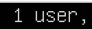
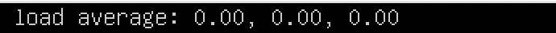
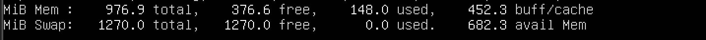
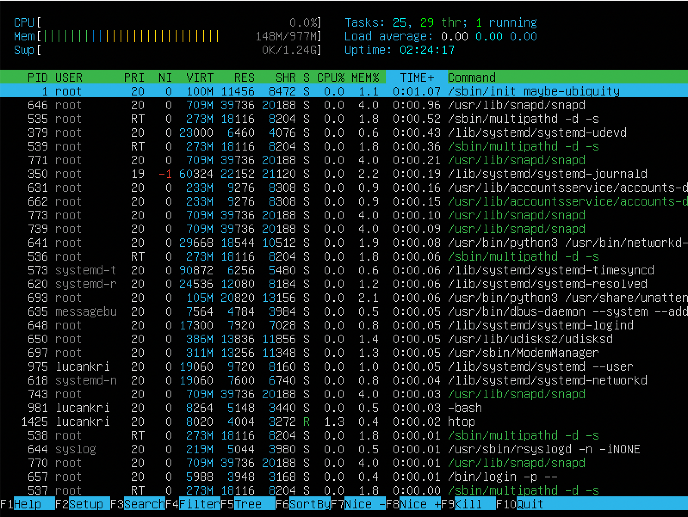
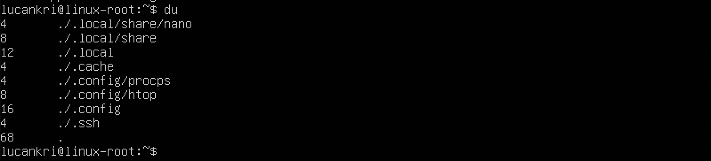

## 1. Установка ОС

* команда узнать версию Ubuntu

## 2. Создание пользователя
* команда создание пользователя

* вывод команды cat /etc/passwd

## 3. Настройка сети ОС
* Задаем название машины вида user-1
    * открываем файл hostname через vim
    

    * меняем название машины
    

    * смотрим изменения
    

* Устанавливаем временную зону, соответствующую нашему текущему местоположению
    * команда для смены временной зоны
    

    * проверяем временную зону
    

* Выводим названия сетевых интерфейсов с помощью консольной команды
    

    * lo - это специальный виртуальный сетевой интерфейс, который ваш компьютер использует для связи с самим собой. Он используется в основном для диагностики и устранения неполадок, а также для подключения к серверам, работающим на локальном компьютере.

 

* Команда что бы получить ip адрес устройства, на котором вы работаете, от DHCP сервера.

    * DHCP - (Dynamic Host Configuration Protocol — протокол динамической настройки узла) — прикладной протокол, позволяющий сетевым устройствам автоматически получать IP-адрес и другие параметры, необходимые для работы в сети TCP/IP

 

* Выводим на экран внешний ip-адрес шлюза (ip) и внутренний IP-адрес шлюза, он же ip-адрес по умолчанию (gw)

    * внешний ip-адресс шлюза
    

    * внутренний ip-адресс шлюза, он же по умолчанию
    

* Задаем статичные (заданные вручную, а не полученные от DHCP сервера) настройки ip, gw, dns (использовать публичный DNS серверы, например 1.1.1.1 или 8.8.8.8)

    * заходим в файл конфигурации с помощью редактора (в данном случае vim) 
    `sudo vim /etc/netplan/00-installer-config.yaml`

    * редактируем файл конфигурации
    

* Перезагружаем виртуальную машину командой: `reboot`.  Убеждаемся, что статичные сетевые настройки (ip, gw, dns) соответствуют заданным в предыдущем пункте.
    * "пингуем" 1.1.1.1
    

    * "пингуем" ya.ru
    

## 4. Обновление ОС
* Обновляем системные пакеты до последней на момент выполнения задания версии.
    * что бы правильно обновить ОС нам нужно выполнить 2 команды
        * 1: `sudo apt-get update` - команда update используется для синхронизации индекса пакетов из репозиториев
        * 2: `sudo apt-get upgrade` - команда upgrade используется для установки самых новых версий пакетов, установленных в системе (т.е. выполняет обновление)
    * убедимся что мы обновлены до последней версии
    

## 5. Использование команды sudo
* Разрешаем пользователю, созданному в Part 2, выполнять команду sudo
    * нужно пользователя добавить в группу sudo командой: `sudo usermod -a -G sudo <имя пользователя>`
    

    * sudo - (Substitute User and do) программа для системного администрирования UNIX-систем. Главное назначение sudo — это выполнить команду от имени другого пользователя, обычно от root. Смысл выполнения команды от root в том, что у него повышенные права доступа и, применяя sudo, обычный пользователь может выполнить те действия, на которые у него недостаточно прав.

    * делаем смену пользователя командой: `sudo su <имя пользователя>`
    

    * Меняем hostname ОС c помощью редактора (в данном случае vim) от имени пользователя, созданного в пункте Part 2 (используя sudo)
    

    * результат
    

## 6. Установка и настройка службы времени
* Настраиваем службу автоматической синхронизации времени
    * с помощью команды `sudo timedatectl set-ntp on`

    * выводим время командой `timedatectl show`
    

## 7. Установка и использование текстовых редакторов
* Устанавливаем текстовые редакторы VIM (+ любые два по желанию NANO, MCEDIT, JOE и т.д.)
    * в нашем случае vim и nano уже установлены, но команды для установки я оставлю, остается установить только JOE или MCEDIT. Команды:
        * установка vim: `sudo apt install vim`
        * установка nano: `sudo apt install nano`
        * установка JOE: `sudo apt install joe`

    * Используем каждый из трех выбранных редакторов, создаем файл test_X.txt, где X -- название редактора, в котором создан файл. Напишите в нём свой никнейм, закрываем файл с сохранением изменений.
        * скриншот редактора vim с содержимым файла
        
        > что бы выйти из редактора с сохранением файла нужно: 
        1: если находимся в режиме редактирования - выйти из него нажав клавишу `esc` 
        2: нажать `:` - наш курсор переместиться вниз (в командную строку) и напечатает `:` 
        3: набрать клавиши `wq` - в итоге получится `:wq` и нажать enter  
        Таким образом мы выйдем из редактора и сохраним файл

        * скриншот редактора nano с содержимым файла
        
        > что бы выйти из редактора с сохранением файла нужно: 
        1: для выхода из редактора нужно нажать сочание клавиш `control + x` 
        2: когда мы выходим из редактора, он предложит нам сохранить файл если в нем были сделданны изменения и нужно нажать `y`, и `enter`

        * скриншот редактора joe с содержимым файла
        
        > что бы выйти из редактора с сохранением файла нужно: 
        1: для выхода из редактора нужно нажать сочание клавиш `control + k` и `q` 
        2: когда мы выходим из редактора, он предложит нам сохранить файл если в нем были сделданны изменения и нужно нажать `y`

    * Используем каждый из трех выбранных редакторов, открываем файл на редактирование, отредактируем файл, заменив никнейм на строку "21 School 21", закрываем файл без сохранения изменений.
        * скриншот редактора vim с содержимым файла
        
        > что бы выйти из редактора без сохранения файла нужно: 
        1: если находимся в режиме редактирования - выйти из него нажав клавишу `esc` 
        2: нажать `:` - наш курсор переместиться вниз (в командную строку) и напечатает `:` 
        3: набрать клавиши `q!` - в итоге получится `:q!` и нажать enter  
        Таким образом мы выйдем из редактора без сохрания файла

        * скриншот редактора nano с содержимым файла
        
        > что бы выйти из редактора без сохранения файла нужно: 
        1: для выхода из редактора нужно нажать сочание клавиш `control + x` 
        2: когда мы выходим из редактора, он предложит нам сохранить файл если в нем были сделданны изменения и нужно нажать `n`

        * скриншот редактора joe с содержимым файла
        
        > что бы выйти из редактора без сохранения файла нужно: 
        1: для выхода из редактора нужно нажать сочание клавиш `control + k` и `q` 
        2: когда мы выходим из редактора, он предложит нам сохранить файл если в нем были сделданны изменения и нужно нажать `n`

    * Используем каждый из трех выбранных редакторов, отредактируем файл ещё раз (по аналогии с предыдущим пунктом), а затем освоим функции поиска по содержимому файла (слово) и замены слова на любое другое.
        * скриншот редактора vim с содержимым файла
            * с результатами поиска слова
            

            * с командами, введёнными для замены слова на другое
            

        * скриншот редактора nano с содержимым файла
            * с результатами поиска слова
            

            * с командами, введёнными для замены слова на другое
            

        * скриншот редактора joe с содержимым файла
            * с результатами поиска слова
            

            * с командами, введёнными для замены слова на другое
            

## 8. Установка и базовая настройка сервиса SSHD
* Устанавливаем службу SSHd
    * что бы установить SSHd нужно использовать команду: `sudo apt install openssh-server`

* Добавляем автостарт службы при загрузке системы
    * что бы это сделать нужно добавить его в автозагрузку командой `sudo systemctl enable sshd`

* Перенастраиваем службу SSHd на порт 2022
    * нам нужно найти файл sshd_config и изменить его с помощью редактора (в данном случае vim) 
    Выполняем команду `vim /etc/ssh/sshd_config` и находим строку где написано `Port 22`. 
    Если строка начинается с символа #, его нужно удалить и вместо 22 порта, написать любой другой, например `Port 2022`
    

* Использем команду ps, показать наличие процесса sshd. Для этого к команде нужно подобрать ключи
    * ps - (process status) — программа в UNIX, Unix-подобных и других POSIX-совместимых операционных системах, ps выводит список текущих процессов на вашем сервере.
    * выводим наличие процесса командой `ps -fL -C sshd`
        * `-f` - вывести максимум доступных данных, например, количество потоков
        * `-L` - отображать потоки процессов в колонках LWP и NLWP
        * `-C` - выбирать процессы по имени команды
        * `sshd` - имя команды

         

        

* Перезагружаем систему командой `reboot`

* Вывод команды `netstat -tan` должен содержать `tcp 0 0 0.0.0.0:2022 0.0.0.0:* LISTEN`

> `-a или -all` - выводит информацию о всех сокетах(об активных которые слушают порты и неактивных, которые не слушают). 
`-n или --numeric` - заставляет netstat печатать адреса, разделенные точками, вместо использования символических имен сетей.
`-t или --tcp` - по протоколу tcp.  
`Recv-Q` - количество байтов, не скопированных пользовательской программой, подключенной к этому сокету. 
`Send-Q` - количество байтов, не подтвержденных удаленным хостом. 
`Local Address` - Адрес и номер порта локального конца сокета. Если не указан параметр --numeric (-n), адрес сокета преобразуется в его каноническое имя хоста (FQDN), а номер порта преобразуется в соответствующее имя службы. 
`Foreign Address` - адрес и номер порта удаленного конца сокета. Аналогичен «Local Address». 
`State` - состояние сокета. Поскольку в необработанном режиме нет состояний и обычно состояния не используются в UDP, этот столбец можно оставить пустым. 
`Proto` - протокол

## 9. Установка и использование утилит top, htop
* Устанавливаем и запускаем утилиты top и htop
    * для установки используем команды: 
    1. установить top: `sudo apt install top`
    2. установить htop: `sudo apt install htop`

* По выводу команды top определить и написать в отчёте:
    

    * uptime
    

    * количество авторизованных пользователей
    

    * общую загрузку системы
    
    
    * общее количество процессов
    
    > `total` - общее количество процессов в системе 
    `running` — количество работающих в данный момент процессов 
    `sleeping` — количество ожидающих событий процессов 
    `stopped` — количество остановленных процессов 
    `zombie` — количество процессов, ожидающих родительский процесс для передачи статуса завершения

    * загрузку cpu
    
    > `us` — процент использования центрального процессора пользовательскими процессам 
    `sy` — процент использования центрального процессора системными процессами 
    `ni` — процент использования центрального процессора процессами с приоритетом, повышенным при помощи вызова 
    `id` — процент времени, когда центральный процессор не используется 
    `wa` — процент использования центрального процессора процессами, ожидающими завершения операций ввода-вывода 
    `hi` - Hardware IRQ (аппаратные прерывания) — процент использования центрального процессора обработчиками аппаратных прерываний 
    `si` - Software Interrupts (программные прерывания) — процент использования центрального процессора обработчиками программных прерываний 
    `st` - Steal Time (заимствованное время) — количество ресурсов центрального процессора "заимствованных" у виртуальной машины гипервизором для других задач (таких, как запуск другой виртуальной машины); это значение будет равно нулю на настольных компьютерах и серверах, не использующих виртуальные машины

    * загрузку памяти
    
    > выводится информация об использовании физической оперативной памяти и раздела подкачки соответственно `swap` 
    `total` - общее количество памяти 
    `used` - количество используемой памяти 
    `free` - количество свободной памяти 
    `buffers` - количество памяти в кэше буферов 

    * pid процесса занимающего больше всего памяти
    

    * pid процесса, занимающего больше всего процессорного времени
    
    > `PID` - номер процесса 
    `USER` - имя пользователя 
    `PR` - какой приоритет имеет процесс в данный момент 
    `NI` - приоритет, присвоенный ему командой `NICE` 
    `VIRT` — виртуальная память, которую использует процесс 
    `RES` — физическая память, занятая данным процессом 
    `SHR` — общий объем памяти, которую данный процесс делит с другими 
    `S` — текущий статус процесса: R — running; S — sleeping, Z — zombie 
    `%CPU` — процент используемого времени центрального процессора 
    `%MEM` — процент ОЗУ, используемой процессом 
    `TIME+` — продолжительность работы процесса с момента запуска 
    `COMMAND` — название команды (программы), которая инициировала процесс. 

* В отчёт вставить скрин с выводом команды htop:
    * Вводим команду `htop`
    
    * отсортированному по PID, PERCENT_CPU, PERCENT_MEM, TIME
        * PID
        

        * PERCENT_CPU
        

        * PERCENT_MEM
        

        * TIME
        

    * отфильтрованному для процесса sshd
    

    * с процессом syslog, найденным, используя поиск
    

    * с добавленным выводом hostname, clock и uptime
    

## 10. Использование утилиты fdisk
* Запускаем команду fdisk -l

## 11. Использование утилиты df
* Запускаем команду df
    * В отчёте написать для корневого раздела (/):
    
    `7379852` - размер раздела 
    `3966316` - размер занятого пространства 
    `3017248` - размер свободного пространства 
    `57%` - процент использования 
    Единица измерения в виводе - Килобайт

* Запускаем команду df -Th
    * В отчёте написать для корневого раздела (/):
    
    `7.1G` - размер раздела 
    `3.8` - размер занятого пространства 
    `2.9` - размер свободного пространства 
    `48%` - процент использования 
    `ext4` - тип файловой системы для раздела 
     
    Чтобы отобразить информацию о дисках в удобночитаемом формате (килобайты, мегабайты, гигабайты и т. д...) надо вызвать команды df с параметром `-h` 
    `-T` - указывает df отоброжать типы файловых систем

## 12. Использование утилиты du
* Запускаем команду du

* Выводим размер папок /home, /var, /var/log (в байтах, в человекочитаемом виде)

* Выводим размер всего содержимого в /var/log (не общее, а каждого вложенного элемента, используя *)

## 13. Установка и использование утилиты ncdu
* Устанавливаем утилиту ncdu

* Выводим размер папок /home, /var, /var/log
    * /home
    

    * /var
    

    * /var/log
    

## 14. Работа с системными журналами
* Написать в отчёте время последней успешной авторизации, имя пользователя и метод входа в систему

> `Jul 20 14:07:38` - время последней успешной авторизации 
`lucankri` - имя пользователя 
`by LOGIN` - метод входа в систему 

* Перезапускаем службу SSHd

* Вставить в отчёт скрин с сообщением о рестарте службы (искать в логах)

## 15. Использование планировщика заданий CRON
* Используем планировщик заданий, запускаем команду uptime через каждые 2 минуты
    

    * Найти в системных журналах строчки (минимум две в заданном временном диапазоне) о выполнении
    

    * Вывести на экран список текущих заданий для CRON
    

* Удалите все задания из планировщика заданий
